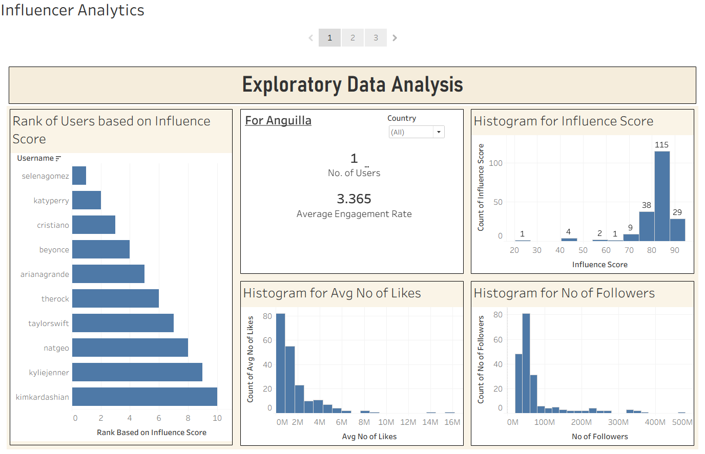
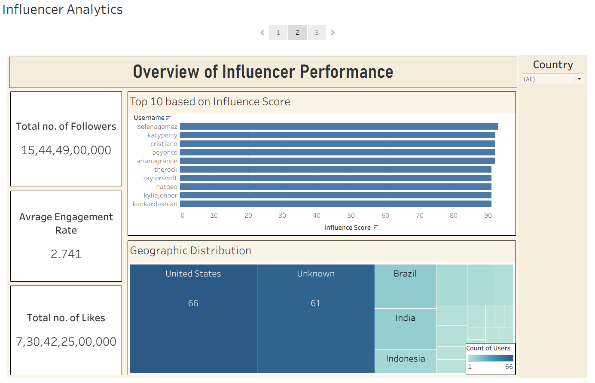
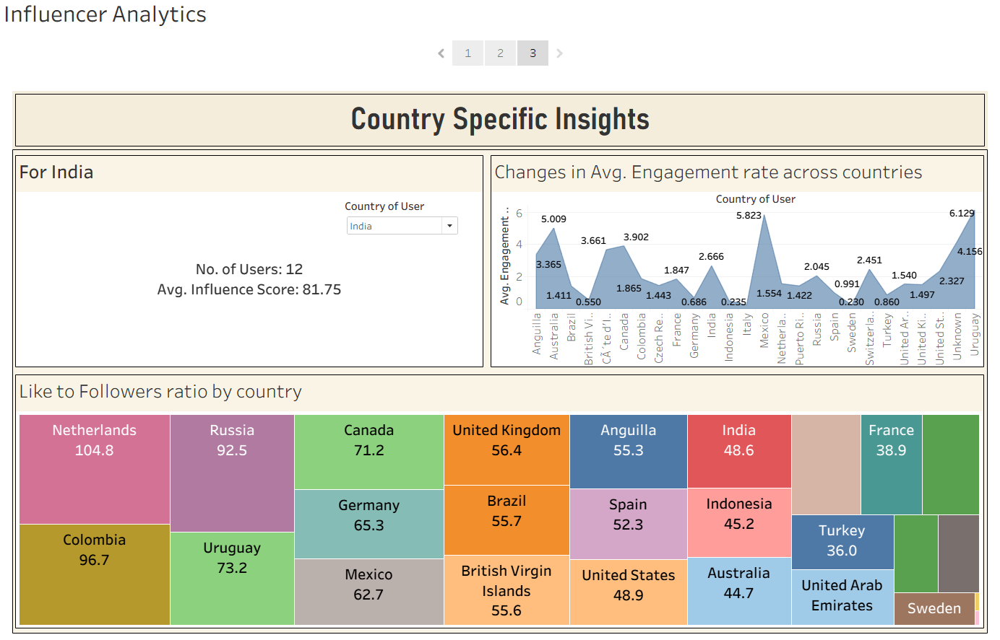

# 📊 Instagram Influencer Analytics Dashboard (Tableau)

## 📌 Project Overview

This project focuses on analyzing Instagram influencer data to understand engagement patterns, influencer performance, and geographic distribution. The project combines Python-based data preprocessing with Tableau dashboards for interactive visualization and storytelling.

---

## 🎯 Objectives

- Analyze influencer performance metrics  
- Understand engagement patterns across users  
- Explore geographic distribution of influencers  
- Create interactive dashboards for business insights  
- Present insights using data storytelling  

---

## 🗂️ Dataset Description

The dataset contains information about Instagram influencers, including:

- Username  
- Country  
- Number of Followers  
- Average Likes  
- Engagement Rate  
- Influence Score  

---

## 🧹 Data Preprocessing (Python)

Data cleaning and preprocessing were performed using Python:

- Handling missing values  
- Removing duplicate records  
- Standardizing data formats  
- Cleaning inconsistent entries  
- Preparing dataset for visualization  

The cleaned dataset was exported and used in Tableau for dashboard creation.

---

## 📊 Tableau Dashboards

This project includes **three dashboards combined into a Tableau Story**, each focusing on a different level of analysis.

---

### 🔹 Dashboard 1: Exploratory Data Analysis

- Distribution of influence score  
- Distribution of followers and likes  
- Ranking of influencers  
- Country-wise engagement overview  



---

### 🔹 Dashboard 2: Influencer Performance Overview

- Top 10 influencers by influence score  
- Total followers and likes  
- Average engagement rate  
- Geographic distribution (Treemap)  



---

### 🔹 Dashboard 3: Country-Specific Insights

- Engagement rate across countries  
- Number of influencers per country  
- Like-to-follower ratio  
- Country-based performance comparison  



---

## 📖 Storytelling Approach

The dashboards are structured into a Tableau Story:

1. Exploratory Analysis → Understanding dataset  
2. Performance Overview → Identifying top influencers  
3. Country Insights → Deep-dive into regional trends  

This flow helps in transforming raw data into meaningful business insights.

---

## 🔍 Key Insights

- Influencer distribution is highly skewed  
- A small number of influencers dominate reach  
- Engagement rate is more important than follower count  
- Geographic differences significantly affect engagement  
- Like-to-follower ratio helps evaluate audience quality  

---

## 🛠️ Technologies Used

- Python (Pandas, NumPy)  
- Tableau  
- Jupyter Notebook  

---

## ▶️ How to Use

1. Open the Tableau file (`.twb` or `.twbx`)  
2. Load the dataset if required  
3. Navigate through dashboards and story  

---

## 📁 Project Structure

```bash
├── data/
│   └── cleaned_dataset.csv
├── notebooks/
│   └── preprocessing.ipynb
├── tableau/
│   └── influencer_dashboard.twb
├── images/
│   ├── dashboard1.png
│   ├── dashboard2.png
│   └── dashboard3.png
└── README.md
```

---

## 🚀 Future Improvements

- Add real-time social media data  
- Integrate dashboard with web app  
- Perform sentiment analysis on influencer content  

---

## 👨‍💻 Author

**Adityakumar Umeshkumar Ahir**  
Data Analyst Intern | Linekdin: https://www.linkedin.com/in/adityaahir/